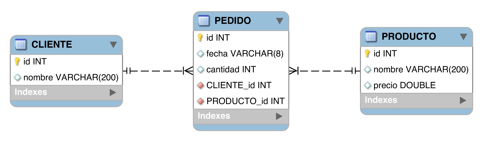
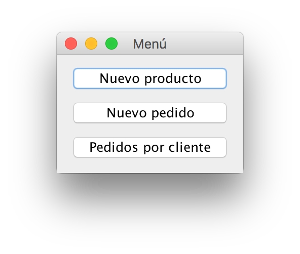
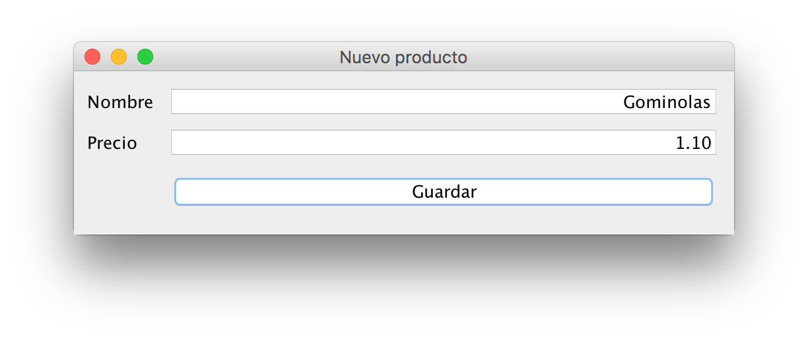
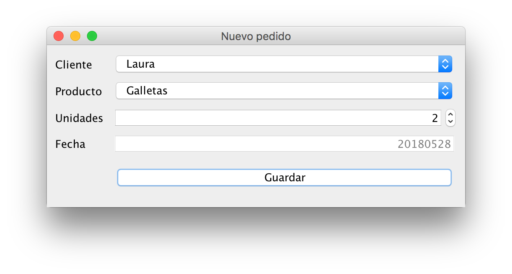
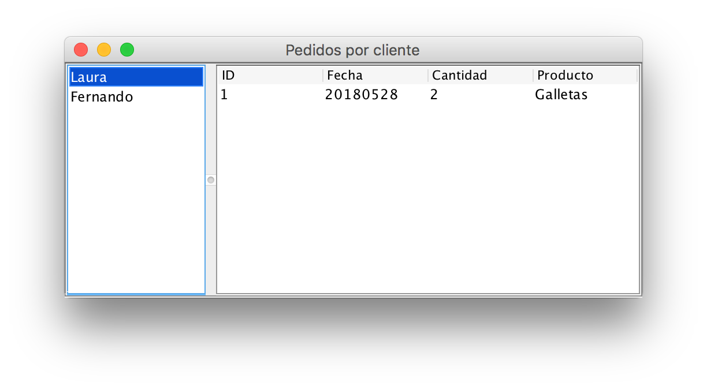

# Ultramarinos

Una tienda de ultramarinos del barrio se ha puesto en contacto con vosotros para que les diseñéis una aplicación de gestión para la tienda.

## Modelo de datos

Nos han proporcionado un diagrama entidad relación para que sepamos los datos que tenemos que almacenar en cada clase:

> Como todavía no tenemos base de datos tendrás que usar estructuras de datos en memoria (listas, etc.) para guardar la información.

## Ventana principal

La app dispone de una ventana inicial que abre las demás:

## Nuevo producto

Desarrolla la ventana `NuevoProducto`, recoge los datos y almacénalos en una estructura de datos adecuada.

## Nuevo pedido

Desarrolla la ventana `NuevoPedido`, recoge los datos y almacénalos en memoria.

> La fecha es un String fijo, no hace falta recoger la fecha del sistema ni nada parecido (a no ser que quieras, claro). 

> Los clientes son fijos, puedes rellenar la lista con datos inventados (u, opcionalmente, hacer una ventana extra).

## Pedidos por cliente

Desarrolla la ventana `PedidoCliente` y muestra los pedidos realizados por el cliente seleccionado actualmente.

> El control de la izquierda es un JList y el de la derecha un JTable. Al hacer click en el JList se tiene que actualizar el contenido del JTable. 
